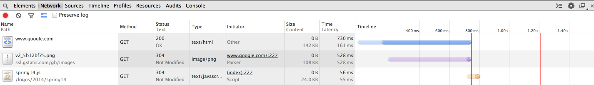
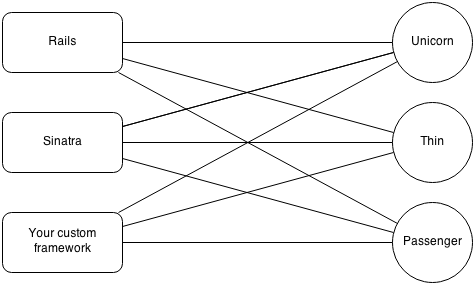
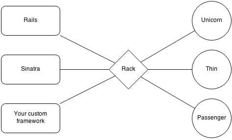
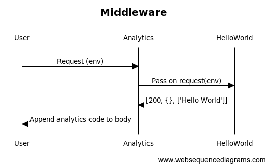
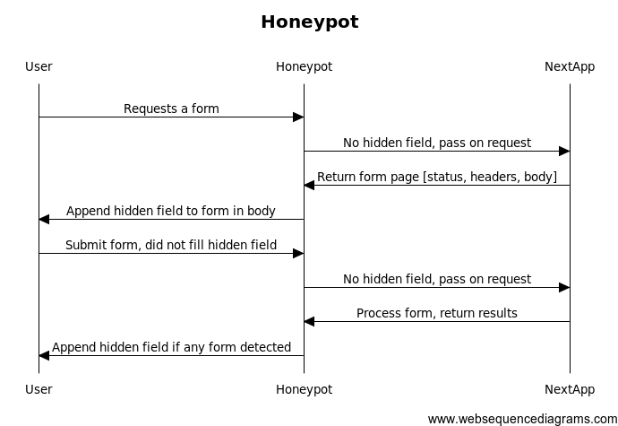
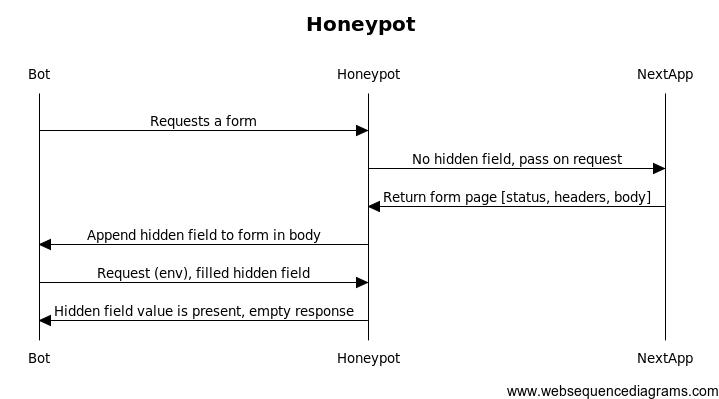
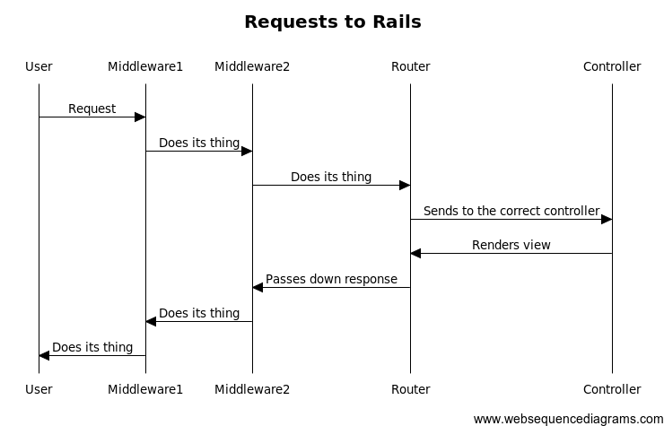

# Rack apps and middleware

---

# What is Rack?


## Used by all the ruby web frameworks

* Rails
* Sinatra
* Others...


## Used by gems that do tasks such as:

* Authentication
* Caching
* Logging
* Many others


## Rack is the second most-downloaded gem

According to rubygems.org


## What does Rack do?

It handles incoming HTTP requests

---

# HTTP

A brief overview


## Requests

Asking a server to:

* return a resource (GET)
* create a resource (POST)
* others (PUT, PATCH, DELETE, etc)


## Requests are sent to a url

such as http://google.com


## Server responds with

Three components:

* Status code
* Headers
* Body


## Status code

* 200 (success)
* 302 (redirect)
* 404 (page not found)
* 500 (internal server error)
* others


## Headers

Metadata such as

* content type
* caching rules
* others


## Body

The requested resource


## Dev tools



---

# Back to Rack


## The problem




## The solution



---

# Why do I care?

I don't build ruby web frameworks


## Great model for HTTP request/response cycle


## Official Rack spec:

* A Ruby object that responds to call
* It takes exactly one argument, the environment
* It returns an Array of exactly three values:
  * the status
  * the headers
  * the body (must respond to `each`)


## Sound familiar?


## Let's see some code:

```ruby
class HelloWorld
  def call(env)
    [200, {'Content-Type' => 'text/plain'}, ['Hello World']]
  end
end
```


## Running the app

```ruby
Rack::Handler::Thin.run HelloWorld.new
```


## What is this env?

```ruby
class Env
  def call(env)
    [200, {'Content-Type' => 'text/plain'}, env.inspect ]
  end
end
```


## env hash

```ruby
{"SERVER_SOFTWARE"=>"thin 1.5.1 codename Straight Razor",
"SERVER_NAME"=>"localhost",
"rack.input"=>#<StringIO:0x007f93aa2ff2e8>,
"rack.version"=>[1, 0],
"rack.errors"=>#<IO:<STDERR>>,
"rack.multithread"=>false,
"rack.multiprocess"=>false,
"rack.run_once"=>false,
"REQUEST_METHOD"=>"GET",
"REQUEST_PATH"=>"/",
"PATH_INFO"=>"/",
"REQUEST_URI"=>"/",
"HTTP_VERSION"=>"HTTP/1.1",
"HTTP_HOST"=>"localhost:5000",
"HTTP_CONNECTION"=>"keep-alive",
"HTTP_CACHE_CONTROL"=>"max-age=0",
"HTTP_ACCEPT"=>"text/html,application/xhtml+xml,application/xml;q=0.9,image/webp,*/*;q=0.8",
"HTTP_USER_AGENT"=>"Mozilla/5.0 (Macintosh; Intel Mac OS X 10_8_4) AppleWebKit/537.36 (KHTML, like Gecko) Chrome/33.0.1750.152 Safari/537.36",
"HTTP_ACCEPT_ENCODING"=>"gzip,deflate,sdch",
"HTTP_ACCEPT_LANGUAGE"=>"en-US,en;q=0.8,fr;q=0.6",
"HTTP_COOKIE"=>"mp_030bc1ac25c5803c2b9d87c2c4231871_mixpanel=%7B%22distinct_id%22%3A%20%221448de3ffeb4c-0c99dee4c-1a10435d-13c680-1448de3ffecac4%22%2C%22%24initial_referrer%22%3A%20%22http%3A%2F%2Flocalhost%3A5000%2F%3Freturn_to%3D%2Fapp%2Fhome%22%2C%22%24initial_referring_domain%22%3A%20%22localhost%3A5000%22%7D",
"GATEWAY_INTERFACE"=>"CGI/1.2",
"SERVER_PORT"=>"5000",
"QUERY_STRING"=>"",
"SERVER_PROTOCOL"=>"HTTP/1.1",
"rack.url_scheme"=>"http",
"SCRIPT_NAME"=>"",
"REMOTE_ADDR"=>"127.0.0.1",
"async.callback"=>#<Method: Thin::Connection#post_process>,
"async.close"=>#<EventMachine::DefaultDeferrable:0x007f93aa30f008>}
```


## So what?

That's super low level. Can't I just write this with Rails/Sinatra?


## Rack's secret power

Rack apps can be chained together




## Code please!

```ruby
class Analytics
  CODE = File.open('analytics.js')

  def initialize
    @app = HelloWorld.new
  end

  def call(env)
    status, headers, body = @app.call(env)
    body = append_code_to(body)
    [status, headers, body]
  end

  private
  def append_code_to(body)
    # append CODE to body
  end
end
```


## Composition is great

... but hardcoding dependencies is brittle


## Dependency injection

```ruby
class Analytics
  def initialize(app)
    @app = app
  end

  # other methods
end
```


## Using dependency injection

```ruby
hello_world = HelloWorld.new
goodbye_world = GoodbyeWorld.new

# stack: analytics, hello world
Rack::Handler::Thin.run Analytics.new(hello_world)

# stack: analytics, goodbye world
Rack::Handler::Thin.run Analytics.new(goodbye_world)
```


## Middleware

Each app gets a chance to:

* change `env` before passing it up to the next app in the chain
* change `[status, headers, body]` before returning


## Examples

* Rack::Static
* Rack::Logger
* Rack::Deflater
* many others...

---

# Real life example


## Rack::Honeypot

Spam trap that is more user friendly than a CAPTCHA

* Add hidden to forms
* Rejects requests where that field was filled in


## User uses the app




## Bot tries to use honeypot




## Code

```ruby
class Honeypot
  def initialize(app)
    @app = app
  end

  def call(env)
    if spambot_submission?(env)
      # return an empty response if there the hidden field was filled
      [200, {'Content-Type' => 'text/html', "Content-Length" => "0"}, []]
    else
      # send the request to the next app in the chain
      # it returns [status, headers, body]
      status, headers, body = @app.call(env)

      # append hidden field to body
      body = insert_honeypot(body)

      # return status, headers and modified body
      [status, headers, body]
    end
  end

  private

  def spambot_submission?(env)
    # check if hidden field was filled
  end

  def insert_honeypot(body)
    # append hidden field to all forms
  end
end
```

---

# Rack::Builder


## Less boilerplate

```ruby
my_stack = Rack::Builder.new do
  use Analytics
  run HelloWorld.new
end

Rack::Handler::Thin.run my_stack
```


##  rackup

converts the supplied rack config file to an instance of
`Rack::Builder` and runs it

```
# config.ru

use Analytics
run HelloWorld.new
```

```
$ rackup
# loads config.ru

$ rackup my_app.ru
```

---

# Rails and Rack


## Rails is rack
You can run a rails server with `rackup`

```ruby
# config.ru

require ::File.expand_path('../config/environment',  __FILE__)
run MyApp::Application
```


## Rails middleware

```
$ rake middleware

use ActionDispatch::Static
use Rack::Lock
use #<ActiveSupport::Cache::Strategy::LocalCache::Middleware:0x007ff01d83b688>
use Rack::Runtime
use Rack::MethodOverride
use ActionDispatch::RequestId
use Rails::Rack::Logger
use ActionDispatch::ShowExceptions
use ActionDispatch::DebugExceptions
use ActionDispatch::RemoteIp
use ActionDispatch::Reloader
use ActionDispatch::Callbacks
use ActiveRecord::ConnectionAdapters::ConnectionManagement
use ActiveRecord::QueryCache
use ActionDispatch::Cookies
use ActionDispatch::Session::CookieStore
use ActionDispatch::Flash
use ActionDispatch::ParamsParser
use ActionDispatch::Head
use Rack::ConditionalGet
use Rack::ETag
use ActionDispatch::BestStandardsSupport
run Middleware::Application.routes
```


## Request/Response in rails



---

# Adding middleware to rails


## `config.middleware`

```ruby
config.middleware.use Honeypot
```

```ruby
config.middleware.insert_after ActiveRecord::QueryCache, Honeypot
```


## Mounting rack apps

```ruby
# routes.rb

# rack app
mount HelloWorld => '/hello_world'

# sinatra app
mount Resque::Server => '/resque'
```


## Mounting rack builder

```ruby
# routes.rb

my_stack = Rack::Builder.new do
  use Analytics
  run HelloWorld
end

mount my_stack => '/hello_world'
```

---

# More learning

* routing via `Rack::Builder`
* deeper rails middleware
* authentication libraries


## Joël Quenneville

* @joelquen (twitter)
* JoelQ (github)
* joelq@thoughtbot.com


## Let's write some middleware!
